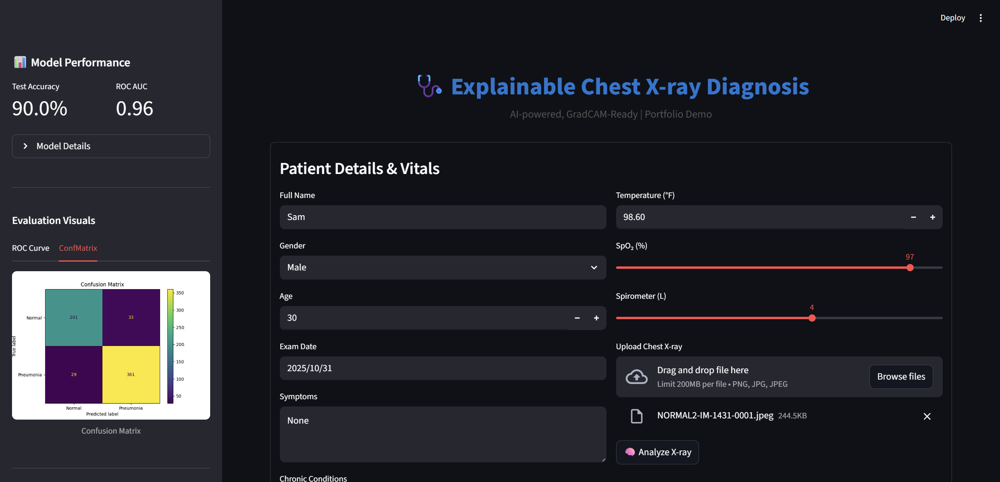

# 🩺 Chest X-ray Classification & Explainable AI App

[](https://chest-x-ray-classification.streamlit.app)

Welcome to a **full-stack, explainable machine learning project for medical chest X-ray analysis** — featuring a modern Streamlit web app with GradCAM explanations, professional PDF reporting, and automated patient report archiving.

---


## 🚀 Demo Features

- **Chest X-ray Image Classification** (Pneumonia vs Normal)
- **Explainable AI**: Visualizes important regions using GradCAM
- **Interactive Streamlit App**: All-in-one clinical input form, results, and analytics dashboard
- **Real-Time PDF Reporting**: Generates beautiful patient PDFs with images and diagnosis, downloadable and archived
- **Automatic Report Foldering**: Each prediction is saved in a unique folder with all relevant images and PDF
- **Evaluation Dashboard** in the sidebar (ROC, Confusion Matrix, usage/batch stats, model info)

---

## 📂 Repo Structure

```bash
├── data/ # Training/Validation/Test image sets
├── database/ # SQLite DB, SQLAlchemy model for patient reports
├── notebooks/ # Jupyter analysis (data EDA, training, etc.)
├── patient_reports/ # Each run archives: X-ray, GradCAM, report.pdf
├── plots/ # Model curves: ROC, Conf Mat, etc.
├── saved_models/ # Trained Keras/TensorFlow models
├── src/ # Core ML/model/training/eval modules
├── streamlit_app/ # Streamlit UI app (main.py)
├── uploads/ # Runtime uploaded files (if used)
├── requirements.txt # All deps (see below)
├── README.md # You're here!
└── .gitignore
```


---

## 🖥️ Usage & Quickstart

**1. Clone the Repo**

```bash
git clone https://github.com/Av1352/Chest-X-ray-Classification.git
cd Chest-X-ray-Classification
```


**2. Set Up Environment**
- Recommended: Python 3.10+, CUDA 11.x+ (if GPU)
- Install all dependencies:
    ```
    pip install -r requirements.txt
    ```

**3. Run the Streamlit App**

```bash
cd streamlit_app
streamlit run streamlit_app/app.py
```

- App opens in your browser at [localhost:8501](http://localhost:8501/)
- For best module imports, always start from the repo root

**4. Try the Features**
- Fill in patient details, upload a chest X-ray, get real-time AI diagnosis and PDF reports
- Download PDFs for your own records — all results are also archived by patient run

---

## 🏆 Example Screenshots


| Main App UI | GradCAM Output | PDF Report Sample |
|:--:|:--:|:--:|
|  |  |  |


---

## 📊 Model Architecture & Evaluation

- **Model:** Custom CNN (see `src/model.py`)
- **Input Dimensions:** 64x64x3
- **Training:** 25 epochs, Adam optimizer, data augmentation
- **Metrics:** Accuracy, ROC AUC, F1, Confusion Matrix
- **Explainability:** GradCAM — see side-by-side overlay in UI and report

---

## 📁 Example Output Structure

On each diagnosis, everything for that case is saved as:

```bash
patient_reports/
└── John_Doe_20251031_162433/
├── xray.png
├── gradcam.png
└── ChestXrayReport_John_Doe_20251031_162433.pdf
```

---

## ⚙️ Advanced Features

- **Persistent, organized archiving** (for dashboards/analytics/auditing)
- **Sidebar dashboard:** Model metrics, ROC, confusion matrix, usage barplots
- **Ready for extension:** Integrate DB logging, further models (ResNet, ViT, etc.)

---

## 💡 Customizing / Extending

- Add new clinical fields to `/streamlit_app/app.py` and PDF generator
- Swap in your own datasets under `/data/`
- Upgrade or swap out model by editing `src/model.py`
- Add dashboards or admin panels from `/patient_reports/` for ongoing monitoring

---

## ⚠️ **Disclaimer**

This project and all output is **for research and educational/demo purposes only**.<br>
Not intended for clinical or diagnostic use in any real-world setting.

---

## 👤 Author and Credits

- **Author:** Anju Vilashni Nandhakumar
- **Contact:** [vxanju.com](https://vxanju.com) | [GitHub](https://github.com/Av1352)

---

## ⭐ Star, Fork, and Share!

If you like this project, star it, fork for your own use, or share with your network!